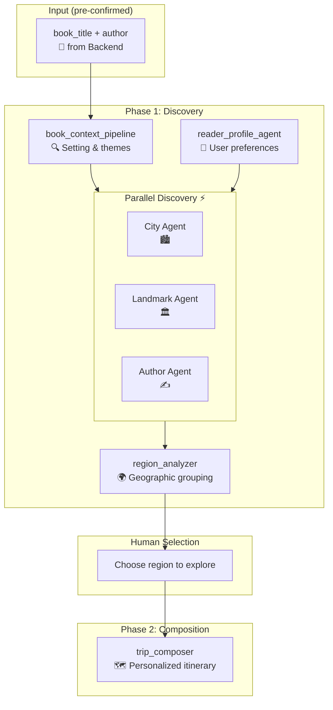

# StoryLand AI

> Turn your favorite books into meaningful travel experiences

**We're live! Try it at [mystoryland.ai](https://mystoryland.ai/)**

## Overview

StoryLand AI transforms the worlds within beloved books into real, actionable travel plans. When readers finish a book they love, they often want to explore the places that inspired it—but turning that impulse into reality requires navigating scattered information across countless sources. StoryLand AI solves this by using a multi-agent system that automatically researches, discovers, and composes personalized travel itineraries based on any book.

## The Problem

When someone finishes a book they love, they want to stay in that world a little longer. They want to:
- Walk the same streets the characters walked
- Feel the atmosphere of the city where the story unfolded
- Visit the real places that inspired the author

But the moment they try, the magic disappears.

### Current Reality

Readers face:
- Endless Google searches across scattered blogs, tourist sites, and forums
- Contradictory or incomplete information
- Too many tabs, too much noise, too many missing pieces
- Frustration that kills the initial inspiration

**Result:** Most people never follow through on exploring the world behind the story.

## The Solution: Multi-Agent Architecture

StoryLand AI uses specialized AI agents that work together to solve this complex problem. Each agent is an expert in a specific part of the journey from book to travel plan.

### Why Agents?

Creating a meaningful travel plan from a book requires:
- **Multiple information sources:** Settings, real locations, cultural context, maps, routes, historical notes, travel details
- **Parallel research:** Looking up landmarks, author sites, filming locations, museums simultaneously
- **Intelligent coordination:** Merging disparate information into a coherent journey
- **Personalization:** Remembering preferences across multiple books

A single LLM prompt can't handle this complexity. Agents can.

## Quick Start

### Installation

```bash
# Clone and setup
git clone <repository-url>
cd storyland-ai
python3 -m venv .venv
source .venv/bin/activate
pip install -e ".[dev]"

# Configure API key
cp .env.example .env
# Edit .env and add your GOOGLE_API_KEY

# Optional: Configure Langfuse for LLM observability
# Add your Langfuse credentials to .env:
# - LANGFUSE_SECRET_KEY
# - LANGFUSE_PUBLIC_KEY
# - LANGFUSE_HOST
```

### Run

```bash
# Basic usage (--author is required)
python main.py "Gone with the Wind" --author "Margaret Mitchell"

# With preferences
python main.py "Pride and Prejudice" --author "Jane Austen" --budget luxury --pace relaxed --museums

# Family trip
python main.py "Harry Potter" --author "J.K. Rowling" --with-kids --budget moderate

# With database persistence and user ID
python main.py "1984" --author "George Orwell" --database --user-id alice

# Custom timeout (default: 300s)
python main.py "War and Peace" --author "Leo Tolstoy" --timeout 600

# FastAPI SSE API server
make run-api
# curl http://localhost:8080/api/v1/health

# Streamlit demo
streamlit run streamlit_demo.py
```

**What you get:**
- Region options to choose from
- Cities to visit with suggested days
- Landmarks tied to the book's setting
- Author-related sites (birthplace, museums, etc.)
- Practical travel details and tips

See [Configuration](#configuration) for environment variables. Run `python main.py --help` for all CLI options.

## Screenshots

### Web Interface (Streamlit)


*Interactive region selection with geographic grouping*


*Detailed itinerary with literary context and practical travel info*

## Architecture

StoryLand AI uses a two-phase workflow with human-in-the-loop region selection. Book title and author are pre-confirmed by the upstream service (Backend → storyland-ai):


```mermaid
flowchart TB
    subgraph Input["Input (pre-confirmed)"]
        DTO[book_title + author<br/>📖 from Backend]
    end

    subgraph Phase1["Phase 1: Discovery"]
        BC[book_context_pipeline<br/>🔍 Setting & themes]
        RP[reader_profile_agent<br/>👤 User preferences]

        subgraph PD["Parallel Discovery ⚡"]
            CP[City Agent<br/>🏙️]
            LP[Landmark Agent<br/>🏛️]
            AP[Author Agent<br/>✍️]
        end

        BC --> PD
        RP --> PD
        PD --> RA[region_analyzer<br/>🌍 Geographic grouping]
    end

    subgraph HITL["Human Selection"]
        Select[Choose region to explore]
    end

    subgraph Phase2["Phase 2: Composition"]
        TC[trip_composer<br/>🗺️ Personalized itinerary]
    end

    DTO --> BC
    RA --> Select
    Select --> TC
```

**Two-phase design:**
1. **Phase 1 (Discovery)**: Finds all locations and groups them into practical travel regions
2. **Human Selection**: User chooses which region(s) to explore (prevents impractical multi-continent itineraries)
3. **Phase 2 (Composition)**: Creates detailed itinerary for selected region(s) only

### Key Components

- **Book Context Agent** - Researches setting, themes, and time period
- **Discovery Agents** - Parallel search for cities, landmarks, and author sites
- **Region Analyzer** - Groups cities by geographic proximity using LLM world knowledge
- **Trip Composer** - Creates personalized itinerary based on user preferences
- **Reader Profile Agent** - Accesses user preferences from session state

**Session State Keys:**

| Key | Phase | Description |
|-----|-------|-------------|
| `book_metadata` | 1 | Exact title and author (from request DTO) |
| `book_context` | 1 | Setting, themes, time period |
| `city_discovery` | 1 | Cities with literary connections |
| `landmark_discovery` | 1 | Specific landmarks and sites |
| `author_sites` | 1 | Author-related locations |
| `region_analysis` | 1 | Geographic region grouping |
| `user:preferences` | All | User travel preferences (persists across sessions) |
| `final_itinerary` | 2 | Complete travel plan |
| `job_failed` | All | Terminal failure marker (set on error, cleared on compose retry) |

**Storage:** In-memory (default) or SQLite persistence. Multi-user support with isolated data. See [Configuration](#configuration) for options.

**Technology Stack:**
- [Google Agent Development Kit (ADK)](https://github.com/google/adk-python)
- Google Gemini 2.0/2.5 models (configurable)
- Pydantic for data validation
- SQLite for persistence

### API (FastAPI SSE)

StoryLand AI includes a FastAPI server with Server-Sent Events streaming for web/mobile clients. The API splits the workflow into two streaming endpoints:

```bash
# Start the API server
make run-api   # http://localhost:8080

# Health check (always open — no secret required)
curl http://localhost:8080/api/v1/health

# Discover locations (phase 1) — streams progress events, returns regions
# Add -H "X-Internal-Secret: <value>" if INTERNAL_API_SECRET is set in .env
curl -N -X POST http://localhost:8080/api/v1/itinerary/discover \
  -H "Content-Type: application/json" \
  -d '{"book_title": "1984", "author": "George Orwell"}'

# Compose itinerary (phase 2) — streams final itinerary
curl -N -X POST http://localhost:8080/api/v1/itinerary/{job_id}/compose \
  -H "Content-Type: application/json" \
  -d '{"region_ids": [1]}'

# Check job status
curl http://localhost:8080/api/v1/itinerary/{job_id}/status
```

SSE event types: `progress`, `metadata`, `regions`, `itinerary`, `error`, `done`.

**Job status states** (`GET /api/v1/itinerary/{job_id}/status`):

| Status | Meaning |
|--------|---------|
| `searching` | Phase 1 (Discovery) in progress |
| `discovering` | Discovery running, collecting locations |
| `regions_ready` | Discovery complete, awaiting region selection |
| `composing` | Phase 2 (Composition) in progress |
| `completed` | Itinerary ready |
| `failed` | Terminal error — book not found, timeout, or cancellation (takes priority over all other states) |

Failed jobs can be retried by calling `/compose` again with the same `job_id`; the failure marker is cleared automatically when a new compose attempt begins.

### AI Models

StoryLand AI uses Google Gemini models (default: `gemini-2.5-flash-lite`) for all agents, chosen for native ADK integration, fast parallel execution (sub-2s response times), and excellent structured output adherence across 16 Pydantic data models. The complete workflow takes 60-100 seconds end-to-end with parallel discovery providing 3x speedup over sequential execution.

## Configuration

All configuration is via environment variables in `.env`. Copy `.env.example` to get started.

| Variable | Description | Default |
|----------|-------------|---------|
| `GOOGLE_API_KEY` | **Required.** Google AI API key from [AI Studio](https://aistudio.google.com/app/apikey) | — |
| `MODEL_NAME` | Gemini model to use | `gemini-2.5-flash-lite` |
| `USE_DATABASE` | Enable SQLite persistence | `false` |
| `DATABASE_URL` | SQLite database path | `sqlite+aiosqlite:///storyland_sessions.db` |
| `SESSION_MAX_EVENTS` | Max events in session | `20` |
| `MAX_CONTEXT_TOKENS` | Max tokens for context window | `30000` |
| `WORKFLOW_TIMEOUT` | Max seconds for entire workflow | `300` |
| `AGENT_TIMEOUT` | Max seconds per agent | `60` |
| `LOG_LEVEL` | Logging level (DEBUG/INFO/WARNING/ERROR) | `INFO` |
| `ENABLE_ADK_DEBUG` | Enable ADK internal debug logging | `false` |
| `LANGFUSE_SECRET_KEY` | Langfuse secret key (optional) | — |
| `LANGFUSE_PUBLIC_KEY` | Langfuse public key (optional) | — |
| `LANGFUSE_HOST` | Langfuse host URL (optional) | — |
| `CORS_ORIGINS` | Allowed CORS origins for API (comma-separated) | `*` |
| `INTERNAL_API_SECRET` | Shared secret with the gateway service — when set, all itinerary endpoints require an `X-Internal-Secret` header with this value. The health endpoint (`/health`) is always open. Leave empty for standalone/dev use. | — |

Free tier includes 15 RPM and 200 requests/day — sufficient for development.

## Development

### Project Structure

```
storyland-ai/
├── models/              # Pydantic data models
│   ├── book.py          # BookMetadata, BookContext, BookInfo
│   ├── discovery.py     # CityDiscovery, LandmarkDiscovery, AuthorSites,
│   │                    # RegionCity, RegionOption, RegionAnalysis
│   ├── itinerary.py     # TripItinerary, CityPlan, CityStop
│   └── preferences.py   # TravelPreferences
│
├── tools/               # ADK tool integrations
│   └── preferences.py   # Session state preferences tool
│
├── agents/              # AI agent definitions
│   ├── book_context_agent.py     # Book setting research
│   ├── discovery_agents.py       # City/landmark/author discovery
│   ├── trip_composer_agent.py    # Itinerary composition
│   ├── reader_profile_agent.py   # Preferences-based personalization
│   ├── region_analyzer_agent.py  # Geographic region grouping
│   ├── orchestrator.py           # Two-phase workflow coordination
│
├── api/                 # FastAPI SSE streaming API
│   ├── app.py           # Application factory with lifespan
│   ├── routes.py        # HTTP endpoints (discover, compose, status, health)
│   ├── streaming.py     # SSE async generators wrapping ADK Runner
│   ├── models.py        # Request/response/SSE event Pydantic models
│   └── dependencies.py  # Shared app state & dependency injection
│
├── services/            # Core services
│   ├── session_service.py   # Session management (InMemory/SQLite)
│   └── context_manager.py   # Context engineering
│
├── common/              # Shared utilities
│   ├── config.py        # Configuration management
│   └── logging.py       # Structured logging (structlog)
│
├── plugins/             # ADK runner plugins
│   └── langfuse_plugin.py  # Langfuse observability & token tracking
│
├── tests/               # Test suite
│   ├── unit/            # Unit tests (no API calls)
│   └── integration/     # Integration tests (VCR cassettes)
│
├── main.py              # CLI entry point
├── streamlit_demo.py    # Streamlit web UI
├── pyproject.toml       # Dependencies & pytest config
└── .env.example         # Environment template
```

### Extending the Codebase

**Adding a new agent** — create in `agents/`, import in `orchestrator.py`:
```python
from google.adk.agents import LlmAgent
def create_my_agent(model):
    return LlmAgent(name="my_agent", model=model, instruction="...")
```

**Adding a new tool** — create in `tools/`:
```python
from google.adk.tools import FunctionTool
def my_function(query: str) -> str:
    return result
my_tool = FunctionTool(my_function)
```

**Adding a new model** — create in `models/`:
```python
from pydantic import BaseModel, Field
class MyModel(BaseModel):
    field1: str = Field(description="Description")
```

### Prompt Engineering

Agent prompts include reliability improvements:

- **Anti-hallucination:** `"If the research found no cities, return an empty list - do not hallucinate."`
- **Error handling:** `"If the tool returns an error, report it clearly and explain what went wrong"`
- **Disambiguation:** Book title and author injected into search queries to avoid confusion with similarly-named books

## Testing

```bash
make test                # Unit tests (264 tests)
make test-integration    # Integration tests with VCR cassettes
make test-all            # Both
make test-cov            # With coverage
```

| Module | Tests | Description |
|--------|-------|-------------|
| `test_models.py` | 46 | Pydantic model validation |
| `test_tools.py` | 4 | Preferences tool |
| `test_agents.py` | 32 | Agent factory functions |
| `test_services.py` | 16 | Session service, context manager |
| `test_workflow_timeout.py` | 6 | Workflow timeout behavior |
| `test_llm_scorer.py` | 18 | LLM scoring models and prompts |
| `test_core.py` | 49 | Events, session state, extraction, regions |
| `test_api.py` | 70 | API models, endpoints, SSE streaming, failure-status |

Integration tests use [VCR.py](https://vcrpy.readthedocs.io/) to record/replay HTTP interactions. For quality evaluation, see [evaluation/README.md](evaluation/README.md).

### Observability

| Mode | Logging | Use Case |
|------|---------|----------|
| `python main.py "book"` | LoggingPlugin (INFO) | Production |
| `python main.py "book" -v` | LoggingPlugin (DEBUG) | Troubleshooting |

## Troubleshooting

- **Rate limits (429):** Retry logic handles automatically. Wait ~60s between books.
- **API key issues:** `python -c "import os; from dotenv import load_dotenv; load_dotenv(); print('OK' if os.getenv('GOOGLE_API_KEY') else 'MISSING')"`
- **Database issues:** `rm storyland_sessions.db` to start fresh
- **Virtual env not activated:** `source .venv/bin/activate`
- **Missing dependencies:** `pip install -e ".[dev]"`
- **Timeout errors:** Increase `WORKFLOW_TIMEOUT` in `.env` (default: 300s)

## Database Reference

When using `--database`, ADK's `DatabaseSessionService` creates a `sessions` table:

```sql
CREATE TABLE sessions (
    app_name VARCHAR(128) NOT NULL,
    user_id VARCHAR(128) NOT NULL,
    id VARCHAR(128) NOT NULL,          -- note: "id", not "session_id"
    state TEXT NOT NULL,               -- JSON-encoded session state
    create_time DATETIME NOT NULL,     -- note: "create_time", not "created_at"
    update_time DATETIME NOT NULL,
    PRIMARY KEY (app_name, user_id, id)
)
```

**State scopes:** No prefix = session-scoped (ephemeral). `user:` prefix = persists across sessions. `app:` prefix = global.

**Common queries:**
```sql
-- User's book history
SELECT id, json_extract(state, '$.book_title') as book, create_time
FROM sessions WHERE app_name = 'storyland' AND user_id = 'alice'
ORDER BY create_time DESC;

-- User preferences (keys with colons must be quoted)
SELECT json_extract(state, '$."user:preferences"') as preferences
FROM sessions WHERE app_name = 'storyland' AND user_id = 'alice'
ORDER BY create_time DESC LIMIT 1;
```

**Maintenance:**
```bash
rm storyland_sessions.db                    # Start fresh
sqlite3 storyland_sessions.db "VACUUM;"     # Reclaim space
cp storyland_sessions.db backup_$(date +%Y%m%d).db  # Backup
```

## Documentation

- **[Architecture Decisions](docs/ARCHITECTURE.md)** - ADRs explaining key design choices
- **[Evaluation & Observability](evaluation/README.md)** - Quality evaluation pipeline and Langfuse token/cost tracking

## Why StoryLand AI?

**For Readers:**
- Turn literary inspiration into real travel experiences
- Save hours of research and planning
- Discover places you'd never find through conventional searches
- Get personalized recommendations that match your travel style

**For Developers:**
- Demonstrates real-world multi-agent coordination
- Shows parallel vs. sequential agent patterns
- Implements session-based personalization
- Production-ready with database persistence and error handling

## Vision

A great book doesn't just end—it opens a door. StoryLand AI helps readers step through it.

We believe that every story deserves to be experienced beyond the page, and every reader should be able to walk through the worlds they love without the friction of scattered information and endless research.

**A single prompt can describe a world—but only agents can build a bridge between that world and real places someone can actually visit.**

---

*Built with Google Agent Development Kit*
