# StoryLand AI

> Turn your favorite books into meaningful travel experiences

## Overview

StoryLand AI transforms the worlds within beloved books into real, actionable travel plans. When readers finish a book they love, they often want to explore the places that inspired it—but turning that impulse into reality requires navigating scattered information across countless sources. StoryLand AI solves this by using a multi-agent system that automatically researches, discovers, and composes personalized travel itineraries based on any book.

## The Problem

When someone finishes a book they love, they want to stay in that world a little longer. They want to:
- Walk the same streets the characters walked
- Feel the atmosphere of the city where the story unfolded
- Visit the real places that inspired the author

But the moment they try, the magic disappears.

### Current Reality

Readers face:
- Endless Google searches across scattered blogs, tourist sites, and forums
- Contradictory or incomplete information
- Too many tabs, too much noise, too many missing pieces
- Frustration that kills the initial inspiration

**Result:** Most people never follow through on exploring the world behind the story.

## The Solution: Multi-Agent Architecture

StoryLand AI uses specialized AI agents that work together to solve this complex problem. Each agent is an expert in a specific part of the journey from book to travel plan.

### Why Agents?

Creating a meaningful travel plan from a book requires:
- **Multiple information sources:** Settings, real locations, cultural context, maps, routes, historical notes, travel details
- **Parallel research:** Looking up landmarks, author sites, filming locations, museums simultaneously
- **Intelligent coordination:** Merging disparate information into a coherent journey
- **Personalization:** Remembering preferences across multiple books

A single LLM prompt can't handle this complexity. Agents can.

## Table of Contents

- [Getting Started](#getting-started)
- [Quick Start](#quick-start)
- [Features](#features)
- [Architecture](#architecture)
- [Project Structure](#project-structure)
- [CLI Usage](#cli-usage)
- [Using Saved Data](#using-saved-data)
- [Development](#development)
- [Database Reference](#database-reference)
- [Troubleshooting](#troubleshooting)

## Getting Started

### Prerequisites

- Python 3.10 or higher
- A [Google AI Studio API key](https://aistudio.google.com/app/apikey) (free tier available)

### Installation

1. **Clone the repository**
   ```bash
   git clone <repository-url>
   cd storyland-ai
   ```

2. **Create and activate a virtual environment**
   ```bash
   python3 -m venv .venv
   source .venv/bin/activate  # On Windows: .venv\Scripts\activate
   ```

3. **Install dependencies**
   ```bash
   pip install -r requirements.txt
   ```

4. **Set up your API key**

   Create a `.env` file in the project root:
   ```bash
   cp .env.example .env
   ```

   Edit `.env` and add your Google API key:
   ```env
   # Required
   GOOGLE_API_KEY=your-actual-api-key-here

   # Optional - Enable database persistence
   USE_DATABASE=false
   DATABASE_URL=sqlite:///storyland_sessions.db
   ```

## Quick Start

### Option 1: CLI (Production Ready)

The fastest way to get a travel itinerary:

```bash
# Basic usage
python main.py "Gone with the Wind"

# With author
python main.py "The Nightingale" --author "Kristin Hannah"

# With database persistence
python main.py "1984" --database

# With preferences
python main.py "Pride and Prejudice" --budget luxury --pace relaxed --museums

# Family trip
python main.py "Harry Potter" --with-kids --budget moderate

# Full example
python main.py "The Great Gatsby" --author "F. Scott Fitzgerald" --user-id charlie --database --budget luxury
```

### Option 2: Jupyter Notebook (Interactive Demo)

For exploration and experimentation:

```bash
# Start Jupyter
jupyter notebook

# Open one of these notebooks:
# - storyland_ai_demo.ipynb (original inline demo)
# - storyland_ai_demo_modular.ipynb (modular demo with imports)
# - sessions_memory_demo.ipynb (11 scenarios showing sessions & preferences)
```

### Option 3: Programmatic Usage

Import and use the modular components:

```python
from google.genai import types
from google.adk.models.google_llm import Gemini
from google.adk.runners import Runner

from services.session_service import create_session_service
from tools.google_books import google_books_tool
from agents.orchestrator import create_workflow

# Configure model
model = Gemini(model="gemini-2.0-flash-lite", api_key="your-key")

# Create services
session_service = create_session_service(use_database=True)

# Create workflow
workflow = create_workflow(model, google_books_tool)

# Create runner
runner = Runner(agent=workflow, app_name="storyland", session_service=session_service)

# Run!
async for event in runner.run_async(user_id="alice", session_id="session1", new_message=...):
    print(event)
```

### What You'll Get

The system generates a structured travel plan including:
- **Cities to visit** with suggested number of days
- **Landmarks and experiences** tied to the book's setting
- **Author-related sites** (birthplace, museums, etc.)
- **Practical details** (time of day, visiting tips)
- **Thematic connections** explaining why each location matters

## Features

### 1. Sessions & State Management

- **In-Memory (Default)**: Fast, perfect for development and testing
- **SQLite-Backed**: Persistent sessions across restarts
- **Multi-scoped State**: Session, user, app, and temporary scopes
- **User Preferences**: Persist across sessions with `user:` prefix

```python
# Preferences persist automatically
state["user:preferences"] = {
    "prefers_museums": True,
    "budget": "moderate",
    "favorite_genres": ["classics"]
}
```

### 2. Context Engineering

- **Sliding Window**: Keep recent N events
- **Token Estimation**: Track conversation size
- **Compaction Detection**: Know when to reduce context
- **ADK Integration**: Use built-in `GetSessionConfig`

```python
from services.context_manager import ContextManager

context_manager = ContextManager(max_events=20)
if context_manager.should_compact(session.events):
    session.events = context_manager.limit_events(session.events)
```

### 3. Personalized Itineraries

The trip composer uses user preferences to tailor recommendations:

```python
# Set preferences in session state
state["user:preferences"] = {
    "budget": "luxury",           # budget, moderate, luxury
    "preferred_pace": "relaxed",  # relaxed, moderate, fast-paced
    "prefers_museums": True,
    "travels_with_kids": False,
    "dietary_restrictions": ["vegetarian"]
}
```

**How preferences affect itineraries:**

| Preference | Impact |
|------------|--------|
| `budget: "budget"` | Free museums, walking tours, affordable cafes |
| `budget: "luxury"` | Premium experiences, fine dining, private tours |
| `preferred_pace: "relaxed"` | 2-3 stops/day, longer breaks |
| `preferred_pace: "fast-paced"` | 5+ stops/day, efficient routing |
| `prefers_museums: true` | Prioritize literary museums, archives |
| `travels_with_kids: true` | Family-friendly activities, avoid long queues |

### 4. Multi-User Support

Each user has isolated sessions and preferences:

```bash
python main.py "Pride and Prejudice" --user-id alice --database
python main.py "Dune" --user-id bob --database
```

### 5. Automated Research

- Agents handle complexity of gathering scattered information
- **Parallel Processing**: Multiple discovery agents work simultaneously
- **Structured Output**: Clear, actionable travel plans

## Architecture

StoryLand AI uses a modular architecture with Google's Agent Development Kit (ADK).


### Project Structure

```
storyland-ai/
├── models/              # Pydantic data models
│   ├── book.py          # BookMetadata, BookContext, BookInfo
│   ├── discovery.py     # CityDiscovery, LandmarkDiscovery, AuthorSites
│   ├── itinerary.py     # TripItinerary, CityPlan, CityStop
│   └── preferences.py   # TravelPreferences
│
├── tools/               # External API integrations
│   ├── google_books.py  # Google Books search tool
│   └── preferences.py   # Session state preferences tool
│
├── agents/              # AI agent definitions
│   ├── book_metadata_agent.py    # Book metadata extraction
│   ├── book_context_agent.py     # Book setting research
│   ├── discovery_agents.py       # City/landmark/author discovery
│   ├── trip_composer_agent.py    # Itinerary composition
│   ├── reader_profile_agent.py   # Preferences-based personalization
│   └── orchestrator.py           # Main workflow coordination
│
├── services/            # Core services
│   ├── session_service.py   # Session management (InMemory/SQLite)
│   └── context_manager.py   # Context engineering
│
├── common/              # Shared utilities
│   ├── config.py        # Configuration management
│   └── logging.py       # Logging utilities
│
├── main.py              # CLI entry point
├── *.ipynb              # Demo notebooks
├── requirements.txt     # Dependencies
└── .env.example         # Environment template
```

### Multi-Agent Workflow

```mermaid
flowchart TB
    subgraph Input
        CLI[CLI Args] --> |"--budget, --pace, etc"| State
        State[Session State<br/>user:preferences]
    end

    subgraph Workflow["SequentialAgent (workflow)"]
        direction TB

        BM[book_metadata_pipeline<br/>📚 Google Books API] --> |state.book_metadata| BC
        BC[book_context_pipeline<br/>🔍 Google Search] --> |state.book_context| RP

        RP[reader_profile_agent<br/>👤 get_preferences_tool] --> |state.reader_profile| PD

        subgraph PD["ParallelAgent ⚡"]
            direction LR
            CP[city_pipeline<br/>🏙️]
            LP[landmark_pipeline<br/>🏛️]
            AP[author_pipeline<br/>✍️]
        end

        PD --> |discoveries| TC
        TC[trip_composer<br/>🗺️ Personalized Itinerary]
    end

    State -.-> |ToolContext.state| RP
    TC --> Output[TripItinerary<br/>JSON Output]
```



### Data Flow


The `reader_profile_agent` uses the `get_preferences_tool` to read `user:preferences` from session state via `ToolContext.state`, then summarizes them for the trip composer.

### Two-Stage Agent Pattern

Each pipeline uses a two-stage approach:
1. **Stage 1 (Researcher)**: Uses tools to gather data
2. **Stage 2 (Formatter)**: Validates with Pydantic schema

This pattern ensures type safety and clean data flow between agents.

### Core Components

#### 1. Book Metadata Agent
- Extracts book information from Google Books API
- Validates with `BookMetadata` Pydantic model
- Saves to `state["book_metadata"]`

#### 2. Book Context Agent
- Researches setting, time period, and themes
- Uses Google Search for deep context
- Validates with `BookContext` Pydantic model

#### 3. Discovery Agents (Parallel)
- **City Agent**: Finds cities to visit
- **Landmark Agent**: Discovers specific places
- **Author Agent**: Locates author-related sites
- All run in parallel for efficiency

#### 4. Trip Composer Agent
- Synthesizes all discoveries into coherent itinerary
- Groups by city, suggests timing
- **Uses user preferences** for personalization:
  - Budget level (budget/moderate/luxury)
  - Pace (relaxed/moderate/fast-paced)
  - Museum preference
  - Traveling with kids
  - Dietary restrictions
- Validates with `TripItinerary` Pydantic model

#### 5. Reader Profile Agent
- Uses `get_preferences_tool` to access `user:preferences` from session state
- Tool reads from `ToolContext.state` (ADK's mechanism for state access)
- Summarizes preferences for trip composer
- Provides personalization context for itinerary generation

## CLI Usage

### Basic Commands

```bash
# Simple query (default user: user1)
python main.py "Gone with the Wind"

# With author
python main.py "The Nightingale" --author "Kristin Hannah"

# Custom user
python main.py "1984" --user-id alice
```

### Advanced Usage

```bash
# Enable SQLite persistence
python main.py "Pride and Prejudice" --database

# With preferences (via CLI flags)
python main.py "The Great Gatsby" --budget luxury --pace relaxed

# Family trip with database
python main.py "Harry Potter" --database --with-kids --budget moderate --museums
```

### Multi-User Support

```bash
# User "alice" explores Pride and Prejudice
python main.py "Pride and Prejudice" --user-id alice --database

# User "bob" explores Dune (completely separate data)
python main.py "Dune" --user-id bob --database

# Alice explores another book (her preferences persist!)
python main.py "Emma" --user-id alice --database
```

**Check user data:**

```bash
# See all users
sqlite3 storyland_sessions.db "SELECT DISTINCT user_id FROM sessions;"

# Count sessions per user
sqlite3 storyland_sessions.db "
SELECT user_id, COUNT(*) as session_count
FROM sessions
GROUP BY user_id;"

# View specific user's sessions
sqlite3 storyland_sessions.db "
SELECT id,
       json_extract(state, '$.book_title') as book,
       create_time
FROM sessions
WHERE user_id = 'alice';"
```

### Help

```bash
python main.py --help
```

## Using Saved Data in Future Runs

When you enable database persistence (`--database` or `USE_DATABASE=true`), all data is saved and can be reused.

### 1. User Preferences Persist

```python
# First session - set preferences
await session_service.create_session(
    app_name="storyland",
    user_id="alice",
    session_id="session-1",
    state={
        "book_title": "Pride and Prejudice",
        "user:preferences": {
            "prefers_museums": True,
            "budget": "moderate"
        }
    }
)

# Later session - preferences auto-loaded!
new_session = await session_service.create_session(
    app_name="storyland",
    user_id="alice",  # Same user
    session_id="session-2",
    state={"book_title": "Emma"}
)

prefs = new_session.state["user:preferences"]  # Available!
```

### 2. Resume Previous Sessions

```python
# Load existing session
session = await session_service.get_session(
    app_name="storyland",
    user_id="alice",
    session_id="previous-session-id"
)

# Access previous itinerary
itinerary = session.state.get("final_itinerary")
```

### 3. Query User History

```python
import sqlite3

def get_user_books(user_id: str):
    conn = sqlite3.connect('storyland_sessions.db')
    cursor = conn.cursor()
    cursor.execute("""
        SELECT json_extract(state, '$.book_title') as book,
               create_time
        FROM sessions
        WHERE user_id = ?
        ORDER BY create_time DESC
    """, (user_id,))
    return cursor.fetchall()
```

### 4. Practical Demo

See **[sessions_memory_demo.ipynb](sessions_memory_demo.ipynb)** for 11 complete scenarios covering sessions, preferences, and context management.

## Development

### Adding New Agents

1. Create agent file in `agents/`:

```python
# agents/my_new_agent.py
from google.adk.agents import LlmAgent

def create_my_agent(model):
    return LlmAgent(
        name="my_agent",
        model=model,
        instruction="Do something..."
    )
```

2. Import in orchestrator and add to workflow

### Adding New Tools

1. Create tool file in `tools/`:

```python
# tools/my_tool.py
from google.adk.tools import FunctionTool

def my_function(query: str) -> str:
    return result

my_tool = FunctionTool(my_function)
```

2. Use in agents

### Adding New Models

```python
# models/my_model.py
from pydantic import BaseModel, Field

class MyModel(BaseModel):
    field1: str = Field(description="Description")
    field2: int = Field(description="Description")
```

## Database Reference

### Schema

ADK's `DatabaseSessionService` creates:

```sql
CREATE TABLE sessions (
    app_name VARCHAR(128) NOT NULL,
    user_id VARCHAR(128) NOT NULL,
    id VARCHAR(128) NOT NULL,
    state TEXT NOT NULL,
    create_time DATETIME NOT NULL,
    update_time DATETIME NOT NULL,
    PRIMARY KEY (app_name, user_id, id)
)
```

**Important:** Column names are:
- `id` (not `session_id`)
- `create_time` (not `created_at`)
- `update_time` (not `updated_at`)

See **[DATABASE_SCHEMA.md](DATABASE_SCHEMA.md)** for complete reference.

### Inspecting Database

```bash
# Open database
sqlite3 storyland_sessions.db

# Inside sqlite3:
.tables                    # List tables
.schema                    # Show structures
.mode column              # Better formatting
.headers on

# View sessions
SELECT * FROM sessions;

# View latest
SELECT * FROM sessions ORDER BY create_time DESC LIMIT 1;

# Exit
.quit
```

**Quick one-liners:**

```bash
# List tables
sqlite3 storyland_sessions.db ".tables"

# Count sessions
sqlite3 storyland_sessions.db "SELECT COUNT(*) FROM sessions;"

# Latest session
sqlite3 -column -header storyland_sessions.db \
  "SELECT id, user_id, create_time FROM sessions ORDER BY create_time DESC LIMIT 1;"
```

## Troubleshooting

### Rate Limits (429 Errors)

The workflow makes ~11 API calls per book, which can hit free tier limits (15 RPM).

**Solution:** The retry logic will handle it automatically. Wait ~60 seconds between books.

### Database Issues

```bash
# Delete database to start fresh
rm storyland_sessions.db

# Check database exists
ls -lh *.db
```

### Import Errors

```bash
# Ensure you're in project root
pwd

# Check Python path
python -c "import sys; print('\\n'.join(sys.path))"
```

### API Key Issues

```bash
# Check API key is set
python -c "import os; from dotenv import load_dotenv; load_dotenv(); print('OK' if os.getenv('GOOGLE_API_KEY') else 'MISSING')"
```

## Configuration

All configuration via environment variables in `.env`:

```env
# Required
GOOGLE_API_KEY=your-google-ai-api-key-here

# Database (optional)
USE_DATABASE=false
DATABASE_URL=sqlite:///storyland_sessions.db

# Session (optional)
SESSION_MAX_EVENTS=20

# Context (optional)
MAX_CONTEXT_TOKENS=30000

# Model (optional)
MODEL_NAME=gemini-2.0-flash-lite

# Logging (optional)
LOG_LEVEL=INFO
```

## Technology Stack

- **Framework:** Google Agent Development Kit (ADK)
- **LLM:** Google Gemini (gemini-2.0-flash-lite)
- **APIs:** Google Books API, Google Search
- **Database:** SQLite (via ADK's DatabaseSessionService)
- **Data Validation:** Pydantic models
- **Agent Patterns:** Sequential and parallel orchestration

## Why StoryLand AI?

**For Readers:**
- Turn literary inspiration into real travel experiences
- Save hours of research and planning
- Discover places you'd never find through conventional searches
- Get personalized recommendations that match your travel style

**For Developers:**
- Demonstrates real-world multi-agent coordination
- Shows parallel vs. sequential agent patterns
- Implements session-based personalization via custom tools
- Shows how tools access session state via `ToolContext`
- Modular architecture with clean separation of concerns
- Production-ready with database persistence and error handling

## Vision

A great book doesn't just end—it opens a door. StoryLand AI helps readers step through it.

We believe that every story deserves to be experienced beyond the page, and every reader should be able to walk through the worlds they love without the friction of scattered information and endless research.

**A single prompt can describe a world—but only agents can build a bridge between that world and real places someone can actually visit.**

## Additional Resources

- **[DATABASE_SCHEMA.md](DATABASE_SCHEMA.md)** - Complete database reference
- **[sessions_memory_demo.ipynb](sessions_memory_demo.ipynb)** - 11 demo scenarios covering sessions, preferences, and context management

---

## License

[Add your license information here]

## Contact

[Add your contact information here]

---

*Built with Google Agent Development Kit*
