# StoryLand AI

> Turn your favorite books into meaningful travel experiences

## Overview

StoryLand AI transforms the worlds within beloved books into real, actionable travel plans. When readers finish a book they love, they often want to explore the places that inspired it—but turning that impulse into reality requires navigating scattered information across countless sources. StoryLand AI solves this by using a multi-agent system that automatically researches, discovers, and composes personalized travel itineraries based on any book.

## The Problem

When someone finishes a book they love, they want to stay in that world a little longer. They want to:
- Walk the same streets the characters walked
- Feel the atmosphere of the city where the story unfolded
- Visit the real places that inspired the author

But the moment they try, the magic disappears.

### Current Reality

Readers face:
- Endless Google searches across scattered blogs, tourist sites, and forums
- Contradictory or incomplete information
- Too many tabs, too much noise, too many missing pieces
- Frustration that kills the initial inspiration

**Result:** Most people never follow through on exploring the world behind the story.

## The Solution: Multi-Agent Architecture

StoryLand AI uses specialized AI agents that work together to solve this complex problem. Each agent is an expert in a specific part of the journey from book to travel plan.

### Why Agents?

Creating a meaningful travel plan from a book requires:
- **Multiple information sources:** Settings, real locations, cultural context, maps, routes, historical notes, travel details
- **Parallel research:** Looking up landmarks, author sites, filming locations, museums simultaneously
- **Intelligent coordination:** Merging disparate information into a coherent journey
- **Personalization:** Remembering preferences across multiple books

A single LLM prompt can't handle this complexity. Agents can.

## Quick Start

### Installation

```bash
# Clone and setup
git clone <repository-url>
cd storyland-ai
python3 -m venv .venv
source .venv/bin/activate
pip install -e ".[dev]"

# Configure API key
cp .env.example .env
# Edit .env and add your GOOGLE_API_KEY
```

### Run

```bash
# Basic usage
python main.py "Gone with the Wind"

# With preferences
python main.py "Pride and Prejudice" --budget luxury --pace relaxed --museums

# Development mode (Web UI)
python main.py --dev
```

**What you get:**
- Region options to choose from
- Cities to visit with suggested days
- Landmarks tied to the book's setting
- Author-related sites (birthplace, museums, etc.)
- Practical travel details and tips

📖 **[Full installation guide →](docs/getting-started.md)**

## Screenshots

### Web Interface (Streamlit)

<div align="center">
  
  <p><i>Interactive region selection with geographic grouping</i></p>
</div>

<div align="center">
  
  <p><i>Detailed itinerary with literary context and practical travel info</i></p>
</div>

**More screenshots:** See [Streamlit Demo Guide](docs/STREAMLIT_DEMO.md) for additional screenshots including the welcome screen and preference configuration.

## Architecture

StoryLand AI uses a three-phase workflow with human-in-the-loop region selection:

```mermaid
flowchart TB
    subgraph Phase1["Phase 1: Metadata"]
        BM[book_metadata_pipeline<br/>📚 Google Books API] --> Extract[Extract exact<br/>title & author]
    end

    subgraph Phase2["Phase 2: Discovery"]
        BC[book_context_pipeline<br/>🔍 Setting & themes]
        RP[reader_profile_agent<br/>👤 User preferences]

        subgraph PD["Parallel Discovery ⚡"]
            CP[City Agent<br/>🏙️]
            LP[Landmark Agent<br/>🏛️]
            AP[Author Agent<br/>✍️]
        end

        BC --> PD
        RP --> PD
        PD --> RA[region_analyzer<br/>🌍 Geographic grouping]
    end

    subgraph HITL["Human Selection"]
        Select[Choose region to explore]
    end

    subgraph Phase3["Phase 3: Composition"]
        TC[trip_composer<br/>🗺️ Personalized itinerary]
    end

    Extract --> BC
    RA --> Select
    Select --> TC
```



**Three-phase design:**
1. **Phase 1 (Metadata)**: Resolves the exact book (handles common titles like "The Nightingale")
2. **Phase 2 (Discovery)**: Finds all locations and groups them into practical travel regions
3. **Human Selection**: User chooses which region(s) to explore (prevents impractical multi-continent itineraries)
4. **Phase 3 (Composition)**: Creates detailed itinerary for selected region(s) only

### Key Components

- **Book Metadata Agent** - Extracts book info from Google Books API
- **Book Context Agent** - Researches setting, themes, and time period
- **Discovery Agents** - Parallel search for cities, landmarks, and author sites
- **Region Analyzer** - Groups cities by geographic proximity using LLM world knowledge
- **Trip Composer** - Creates personalized itinerary based on user preferences
- **Reader Profile Agent** - Accesses user preferences from session state

**Session & State:**
- In-memory (default) or SQLite persistence
- User preferences persist across sessions
- Multi-user support with isolated data

**Technology Stack:**
- [Google Agent Development Kit (ADK)](https://github.com/googleapis/python-genai)
- Google Gemini 2.0/2.5 models (configurable)
- Pydantic for data validation
- SQLite for persistence

### AI Models

**Powered by Google Gemini**

StoryLand AI leverages Google's Gemini models as the foundation for all agent intelligence:

**Why Gemini?**
- **Native ADK Integration:** First-class support in Google Agent Development Kit with seamless multi-agent orchestration, session management, and tool calling
- **Fast Parallel Execution:** Sub-2 second response times enable efficient concurrent agent execution (3 agents running in parallel)
- **Superior Structured Output:** Excellent JSON mode adherence for Pydantic schema validation across all 11 data models
- **Cost-Effective for Multi-Agent Systems:** Free tier supports 15 requests per minute, sufficient for development and demos
- **World Knowledge for Geography:** Built-in geographic understanding enables region grouping without external maps API

**Model Configuration:**
- **Default:** `gemini-2.0-flash-lite` (configurable via `MODEL_NAME` in .env)
- **Alternatives:** `gemini-2.0-flash-exp`, `gemini-2.5-flash-preview-0205`, or any Gemini model
- **All Agents:** Same model used across metadata, discovery, region analysis, and composition
- **Eval Judge:** Gemini 2.0 Flash Lite for cost-effective rubric-based evaluation

**Performance Metrics:**
- Typical workflow: 60-100 seconds end-to-end (3 phases)
- Parallel discovery: 3x speedup vs sequential (15s vs 45s)
- Token efficiency: ~8,000-12,000 tokens per complete itinerary
- Rate limits: Handles free tier 15 RPM with exponential backoff retry

## Documentation

- **[Getting Started](docs/getting-started.md)** - Installation, setup, and usage options
- **[CLI Usage](docs/cli-usage.md)** - Command-line options and examples
- **[Observability](docs/observability.md)** - Logging and debugging
- **[Testing](docs/testing.md)** - Unit tests and evaluation framework
- **[Development](docs/development.md)** - Project structure and development guide
- **[Configuration](docs/configuration.md)** - Environment variables reference
- **[Troubleshooting](docs/troubleshooting.md)** - Common issues and solutions

## Additional Resources

- **[DATABASE_SCHEMA.md](DATABASE_SCHEMA.md)** - Complete database reference
- **[sessions_memory_demo.ipynb](sessions_memory_demo.ipynb)** - Session and preference demos
- **[storyland_showcase.ipynb](storyland_showcase.ipynb)** - Full feature showcase

## Why StoryLand AI?

**For Readers:**
- Turn literary inspiration into real travel experiences
- Save hours of research and planning
- Discover places you'd never find through conventional searches
- Get personalized recommendations that match your travel style

**For Developers:**
- Demonstrates real-world multi-agent coordination
- Shows parallel vs. sequential agent patterns
- Implements session-based personalization
- Production-ready with database persistence and error handling

## Vision

A great book doesn't just end—it opens a door. StoryLand AI helps readers step through it.

We believe that every story deserves to be experienced beyond the page, and every reader should be able to walk through the worlds they love without the friction of scattered information and endless research.

**A single prompt can describe a world—but only agents can build a bridge between that world and real places someone can actually visit.**

---

*Built with Google Agent Development Kit*
