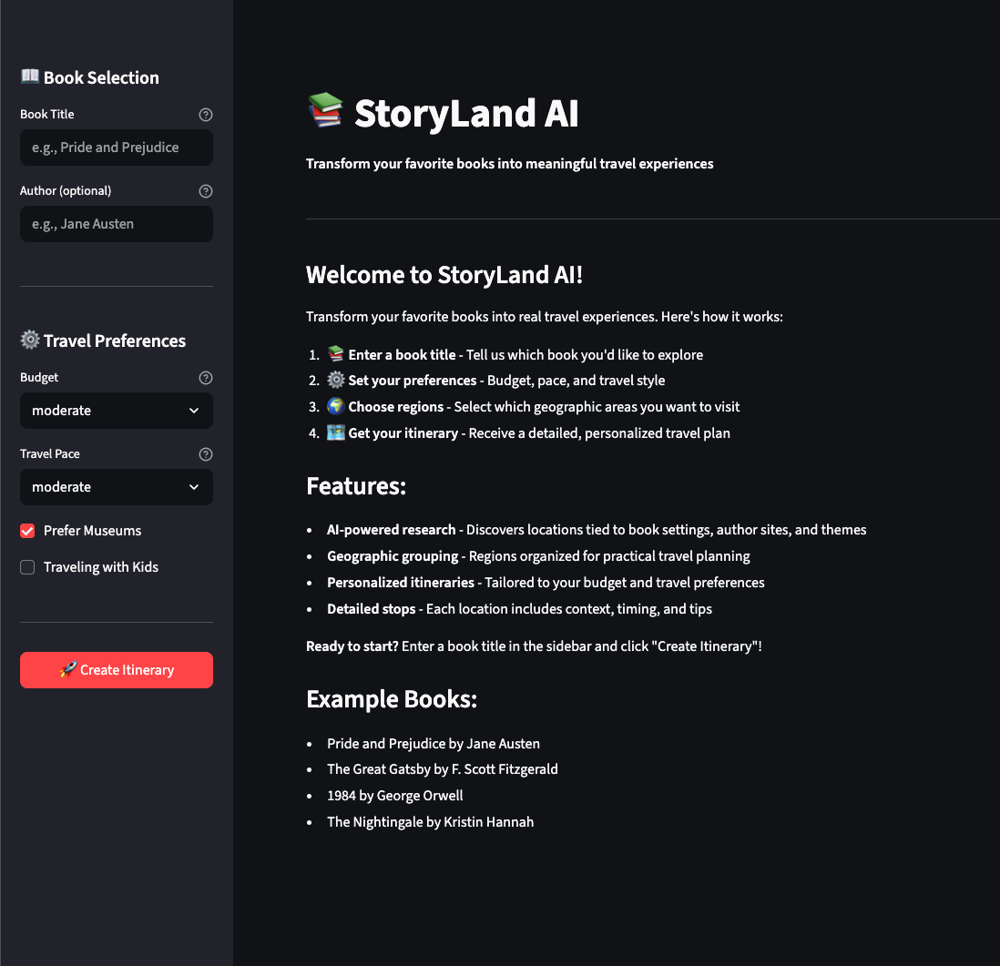

# StoryLand AI - Streamlit Demo

An interactive web demo that transforms books into personalized travel itineraries.

## Quick Start

### 1. Install Dependencies

```bash
pip install -e .
```

This will install all required packages including Streamlit.

### 2. Configure API Key

Make sure you have a `.env` file in the project root with your Google API key:

```env
GOOGLE_API_KEY=your-google-ai-api-key-here
```

If you don't have a `.env` file, copy from the example:

```bash
cp .env.example .env
```

Then edit `.env` and add your API key.

### 3. Run the Demo

```bash
streamlit run streamlit_demo.py
```

The app will open automatically in your browser at `http://localhost:8501`

## How to Use

### Step 1: Enter Book Information
In the sidebar, enter:
- **Book Title** - e.g., "Pride and Prejudice"
- **Author** (optional) - e.g., "Jane Austen" (helps find the exact book)

### Step 2: Set Travel Preferences
Configure your travel style:
- **Budget** - budget, moderate, or luxury
- **Travel Pace** - relaxed, moderate, or fast-paced
- **Prefer Museums** - Check if you want museum recommendations
- **Traveling with Kids** - Check for family-friendly options

### Step 3: Click "Create Itinerary"
The app will:
1. Extract book metadata using Google Books API
2. Discover locations related to the book
3. Analyze and group locations into travel regions

### Step 4: Select Travel Region(s)
The app displays region options with:
- Cities in each region
- Estimated duration
- Travel notes
- Highlights

Select one or more regions you'd like to explore.

### Step 5: Create Detailed Itinerary
Click "Create Detailed Itinerary" to generate a personalized travel plan with:
- Cities to visit with suggested days
- Specific stops (landmarks, museums, author sites)
- Why each location matters to the book
- Practical notes and timing

## Features

### Beautiful UI
- **Region Cards** - Visual cards showing each travel region
- **Expandable City Plans** - Each city has detailed stops
- **Icon-based Stops** - Different icons for landmarks, museums, cafes, etc.
- **Progress Tracking** - Real-time progress as the workflow runs

### Personalization
The itinerary adapts to your preferences:
- Budget affects accommodation and dining recommendations
- Pace affects number of stops per day
- Museum preference prioritizes literary museums
- Kid-friendly option suggests family activities

### Smart Region Grouping
The app groups cities into practical travel regions based on:
- Geographic proximity
- Transportation connectivity
- Practical travel planning

## Example Books to Try

- **Pride and Prejudice** by Jane Austen
- **The Great Gatsby** by F. Scott Fitzgerald
- **1984** by George Orwell
- **The Nightingale** by Kristin Hannah
- **Gone with the Wind** by Margaret Mitchell
- **Harry Potter** series by J.K. Rowling

## Troubleshooting

### "No module named streamlit"
```bash
pip install streamlit
```

### "GOOGLE_API_KEY not found"
Make sure you have a `.env` file with your Google API key:
```env
GOOGLE_API_KEY=your-actual-api-key-here
```

### Rate Limit Errors (429)
The free tier has limits (15 requests per minute). Wait a minute and try again.

### Port Already in Use
If port 8501 is in use, specify a different port:
```bash
streamlit run streamlit_demo.py --server.port 8502
```

## Architecture

The demo uses the same three-phase workflow as the CLI:

```
Phase 1: Metadata Extraction
    ↓
Phase 2: Discovery & Region Analysis
    ↓
User Selection (Streamlit UI)
    ↓
Phase 3: Itinerary Composition
```

All phases use the Google Agent Development Kit (ADK) with specialized agents:
- `book_metadata_pipeline` - Extract book info
- `book_context_pipeline` - Research settings
- `discovery_agents` - Find cities, landmarks, author sites (parallel)
- `region_analyzer` - Group locations geographically
- `trip_composer` - Create personalized itinerary

## Technical Details

- **Framework**: Streamlit 1.28+
- **AI Framework**: Google Agent Development Kit (ADK)
- **Model**: Gemini 2.0 Flash Lite
- **Session Storage**: In-memory (no database persistence for demo)
- **Async Execution**: Uses asyncio.run() to handle async workflows

## Next Steps

For production use with database persistence and advanced features, see:
- [main.py](main.py) - Full CLI with all options
- [README.md](README.md) - Complete documentation
- [storyland_showcase.ipynb](storyland_showcase.ipynb) - Jupyter notebook demos

## Demo Screenshots

### 1. Initial Welcome Screen



The app opens with a clean interface where you can:
- Enter book title and optional author in the sidebar
- Configure travel preferences (budget, pace, museums, kids)
- Click "Create Itinerary" to start the discovery process

### 2. Region Selection UI


After discovery completes, the app displays beautiful region cards showing:
- Cities included in each region
- Estimated trip duration (days)
- Travel notes and logistics
- Key highlights for that region
- Interactive checkboxes to select which region(s) you want to explore

### 3. Locations Preview


The sidebar offers comprehensive personalization options:
- **Budget:** Budget, Moderate, or Luxury
- **Travel Pace:** Relaxed, Moderate, or Fast-paced
- **Prefer Museums:** Toggle for literary museum recommendations
- **Traveling with Kids:** Family-friendly activity suggestions

### 4. Final Itinerary Display


The final itinerary provides detailed travel plans:
- Expandable city sections with suggested days
- Specific stops (landmarks, museums, cafes, author sites)
- Why each location matters to the book
- Practical timing and visit notes
- Trip summary with literary context
