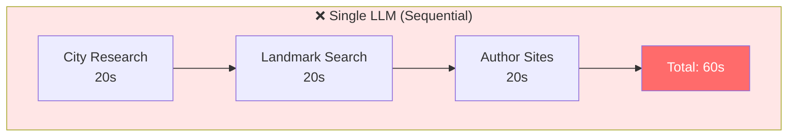
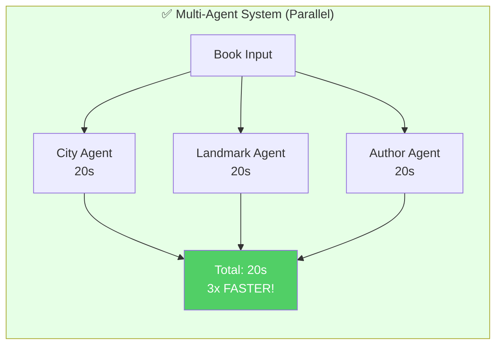
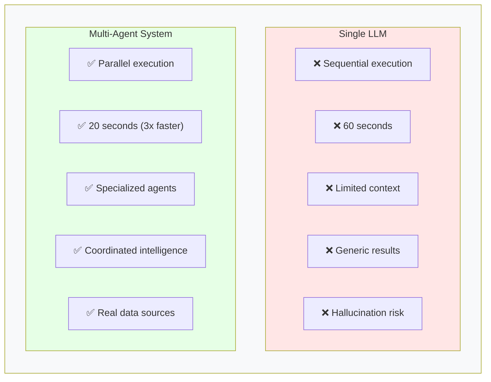
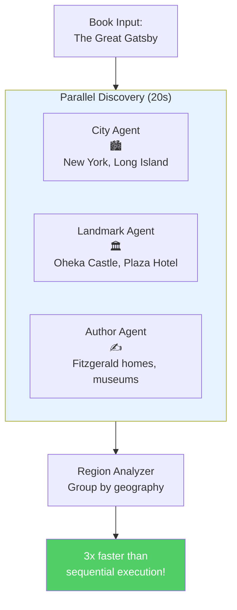
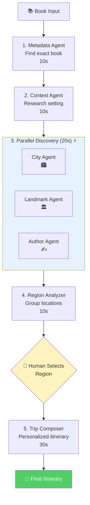
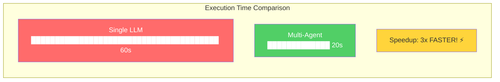

# Why Agents? - Visual Diagrams

## Sequential vs Parallel Execution Comparison

### Option 1: Timeline Comparison (Recommended for Video)

```mermaid
gantt
    title Single LLM (Sequential) - 60 seconds total
    dateFormat X
    axisFormat %L

    section Sequential
    City Research (20s)      :0, 20
    Landmark Search (20s)    :20, 40
    Author Sites (20s)       :40, 60
```

```mermaid
gantt
    title Multi-Agent System (Parallel) - 20 seconds total
    dateFormat X
    axisFormat %L

    section Parallel
    City Agent (20s)         :0, 20
    Landmark Agent (20s)     :0, 20
    Author Agent (20s)       :0, 20
```

### Option 2: Flowchart Comparison

### Option 3: Side-by-Side Feature Comparison

### Option 4: Agent Architecture Overview

### Option 5: Full 6-Agent System (Extended View)

### Option 6: Simple Speed Comparison Bar Chart

---

## Recommended Usage for Video (0:30-1:00)

### Primary Visual: Option 2 (Flowchart Comparison)
Shows both sequential and parallel side-by-side with clear visual difference.

### Secondary Visual: Option 6 (Bar Chart)
Simple, bold "3x FASTER" message - great for emphasis.

### For Technical Presentations: Option 5 (Full System)
Shows all 6 agents and the complete workflow.

---

## How to Use in Presentation

1. **Start with Option 2** (Sequential flowchart) - show the slow path
2. **Transition to Option 2** (Parallel flowchart) - show the fast path
3. **Emphasize with Option 6** (Bar chart) - highlight "3x FASTER!"
4. **Optional**: End with Option 5 (Full system) for architecture context

---

## Export Instructions

### For PowerPoint/Keynote:
1. Copy Mermaid code to https://mermaid.live
2. Download as PNG or SVG
3. Insert into slide

### For Web/Streamlit:
Use `st.mermaid()` or embed directly

### For Video Editing:
Export as high-res PNG (1920x1080) with transparent background

---

## Animation Suggestions

If using animation software:

1. **Sequential**: Show bars filling one after another (20s → 20s → 20s)
2. **Parallel**: Show all three bars filling simultaneously
3. **Zoom effect**: Zoom into "3x FASTER!" text
4. **Color change**: Sequential in red, Parallel in green
5. **Sound effect**: Add satisfying "swoosh" when showing parallel speed
