# Why Agents? - Visual Diagrams

## Sequential vs Parallel Execution Comparison

### Option 1: Timeline Comparison (Recommended for Video)

### Option 2: Flowchart Comparison

### Option 3: Side-by-Side Feature Comparison

```mermaid
flowchart LR
    subgraph comparison[" "]
        direction TB

        subgraph left["Single LLM"]
            L1["❌ Sequential execution"]
            L2["❌ 60 seconds"]
            L3["❌ Limited context"]
            L4["❌ Generic results"]
            L5["❌ Hallucination risk"]
        end

        subgraph right["Multi-Agent System"]
            R1["✅ Parallel execution"]
            R2["✅ 20 seconds (3x faster)"]
            R3["✅ Specialized agents"]
            R4["✅ Coordinated intelligence"]
            R5["✅ Real data sources"]
        end
    end

    style left fill:#ffe6e6
    style right fill:#e6ffe6
    style comparison fill:#f8f9fa
```

### Option 4: Agent Architecture Overview

### Option 5: Full 6-Agent System (Extended View)

```mermaid
flowchart TB
    INPUT[📚 Book Input]

    INPUT --> META[1. Metadata Agent<br/>Find exact book<br/>10s]

    META --> CONTEXT[2. Context Agent<br/>Research setting<br/>10s]

    CONTEXT --> PARALLEL

    subgraph PARALLEL["3. Parallel Discovery (20s) ⚡"]
        direction LR
        CITY[City Agent<br/>🏙️]
        LAND[Landmark Agent<br/>🏛️]
        AUTH[Author Agent<br/>✍️]
    end

    PARALLEL --> REGION[4. Region Analyzer<br/>Group locations<br/>10s]

    REGION --> HITL{👤 Human Selects<br/>Region}

    HITL --> COMPOSE[5. Trip Composer<br/>Personalized itinerary<br/>30s]

    COMPOSE --> OUTPUT[📍 Final Itinerary]

    style PARALLEL fill:#e6f3ff
    style HITL fill:#fff3bf
    style OUTPUT fill:#51cf66,color:#fff
```

### Option 6: Simple Speed Comparison Bar Chart

```mermaid
graph LR
    subgraph speed["Execution Time Comparison"]
        direction TB

        A["Single LLM<br/>███████████████████████████████████████ 60s"]
        B["Multi-Agent<br/>█████████████ 20s"]
        C["Speedup: 3x FASTER! ⚡"]
    end

    style A fill:#ff6b6b,color:#fff
    style B fill:#51cf66,color:#fff
    style C fill:#ffd43b
```

